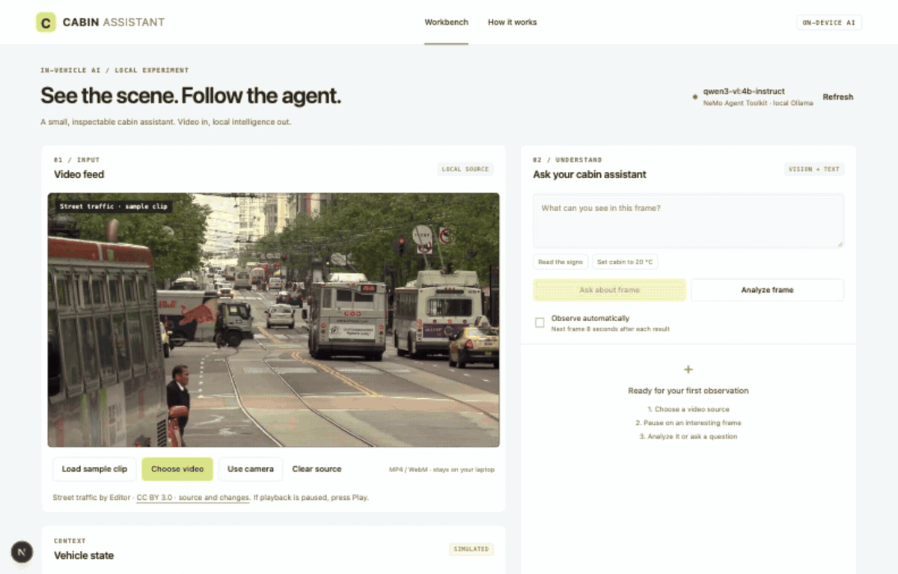

# Cabin Assistant

A local **NVIDIA NeMo Agent Toolkit + Ollama + Next.js** cabin-assistant application for macOS and Windows laptops. Inspired by [NVIDIA’s in-vehicle agent architecture](https://developer.nvidia.com/blog/how-to-build-in-vehicle-ai-agents-with-nvidia-from-cloud-to-car/).

**This repository contains usable application code that you can install, run locally, modify, and build on.** It supports your own video files or webcam, local visual question answering, automatic frame observation, and inspectable agent tool execution. The included traffic clip is sample input; the application works with your own footage.

The application uses NVIDIA’s actual **NeMo Agent Toolkit 1.9.0** built-in `tool_calling_agent`. It selects registered tools, executes them, sends their results back to the model, and produces a final answer. Ollama runs Qwen3-VL on your laptop. Vehicle telemetry and cabin controls currently use simulated state; connecting real vehicle APIs requires a separate integration. This application does not control driving. No NVIDIA automotive hardware, cloud account, or API key is required.



[Recording details and footage attribution](docs/assets/README.md).

## Install on your laptop

**Start with the step-by-step guide: [macOS](docs/INSTALL.md#macos) · [Windows PowerShell](docs/INSTALL.md#windows-powershell).** It covers installing prerequisites, starting the services, using the application, and troubleshooting.

Prerequisites: Git, Node.js 22 LTS or 24 LTS, native [Ollama](https://ollama.com/download), and [uv](https://docs.astral.sh/uv/getting-started/installation/). `uv` installs the pinned Python 3.12 environment. Allow space for dependencies and the approximately 3.3 GB model download; 16 GB or more RAM is a practical starting recommendation, not a verified minimum. CPU-only inference can be slow. Dependencies and weights need internet for setup; inference runs locally afterward.

Apple Silicon macOS has been tested with real model inference. Native Windows has its own installation instructions and CI job; GPU inference on a Windows laptop has not been manually verified. See the [latest checks](https://github.com/azaro-infra/adas/actions/workflows/ci.yml) for dependency, test, and build results. Windows ARM is not covered.

If you already have the prerequisites:

```bash
git clone https://github.com/azaro-infra/adas.git
cd adas
npm ci
uv sync --project backend --locked
```

Open three terminals **in the cloned `adas` directory**. On Windows PowerShell, use `npm.cmd` instead of `npm` if execution policy blocks `npm.ps1`; no policy change is necessary.

```bash
# Terminal 1 — quit Ollama from the menu bar/system tray first
# This starts Ollama with cloud features disabled, bound to loopback.
npm run ollama
```

```bash
# Terminal 2 — NVIDIA NeMo agent on 127.0.0.1:8000
ollama pull qwen3-vl:4b-instruct
npm run agent
```

```bash
# Terminal 3 — Next.js dashboard on 127.0.0.1:3000
npm run dev
```

Open **http://127.0.0.1:3000** and click Refresh if a service was started later. Keep the terminals open. Stop each service with **Ctrl+C**. Future runs only need the three start commands; the model remains downloaded.

## Try it in five minutes

1. The real street-traffic sample loads automatically from the local server in any browser. Press Play if autoplay is blocked. **Load sample clip** restores it after switching sources. You can also choose your own video, the synthetic `tests/fixtures/test-clip.mp4`, or a webcam. Your own video stays in its browser tab; only a resized JPEG frame is sent to the local backend.
2. Pause the video on a clear frame and ask “Describe the visible vehicles and tell me the simulated battery level.” The agent should select `inspect_frame` and `read_vehicle_status`.
3. Expand each tool’s **Result returned to the model** and inspect the execution trace. These are actual tool results and NeMo events.
4. Ask “Set the cabin temperature to 20 °C.” NeMo invokes the simulated tool, reads its result, and answers. The dashboard applies the returned state automatically after the request succeeds.
5. Automatic observation samples another frame eight seconds after each result. It is read-only and does not queue video frames.

For a reproducible check, open a fourth terminal in `adas` and run `npm run test:local` (`npm.cmd run test:local` on Windows). It sends a supplied text-card image, checks the model reads “CABIN LAB” and the 76% battery value, then checks the 20 °C action. Successful output ends with `PASS: NVIDIA NeMo native tool loop, local vision, telemetry, and applied simulator change.`

## What runs where

```text
Browser: local video → canvas → one JPEG + question + simulated state
    │ POST /api/analyze
Next.js (3000): validate input → proxy to Python → validate response
    │ POST /analyze
NVIDIA NeMo Agent Toolkit (8000): built-in tool_calling_agent
    │ model chooses native tool calls
    ├─ inspect_frame(question) → local Qwen3-VL vision inference
    ├─ read_vehicle_status() → current request's simulated state
    └─ set_cabin_temperature(temperature) → policy → updated simulation
    │ tool results → model → another tool round or final answer
    ▼
Dashboard: answer, actual tool inputs/results, state, NeMo trace, sampled frame

All model requests → native Ollama (127.0.0.1:11434) → supported local GPU or CPU
```

The model is shared by orchestration and vision. The agent initially receives text; `inspect_frame` supplies the image to a separate call of the same local model. This makes visual inspection an explicit, inspectable tool. The YAML’s `_type: openai` means the **OpenAI-compatible API protocol served by local Ollama**. It does not call OpenAI or require a real API key. Its URL is fixed to loopback.

What is NVIDIA software here: NeMo’s workflow loader, configuration, tool registration, built-in agent, and profiler events. What is substituted: native Ollama for NVIDIA automotive inference engines, Qwen3-VL for model inference, browser simulation for vehicle APIs. DriveOS, TensorRT Edge-LLM, NVIDIA automotive hardware, speech, and cloud agents are not part of the current application. Ollama uses Metal on Apple Silicon and may use CUDA or another supported backend on Windows.

## File map and reading order

Start with **`backend/configs/cabin.yml`**, then **`backend/cabin_agent/tools.py`**. Those two files define the agent’s model, instructions, and capabilities.

```text
backend/
  configs/cabin.yml          Real NAT workflow: model, functions, built-in agent
  cabin_agent/
    tools.py                 Three registered NAT tools and temperature policy
    vision.py                Fixed-loopback Ollama image inference
    models.py                Validated input and request-scoped simulator state
    server.py                HTTP adapter, workflow lifecycle, cancellation, events
  tests/test_workflow.py     Real NAT graph tests; only model output is replaced
  pyproject.toml             Python dependencies and NAT plugin entry point
  uv.lock                   Reproducible Python dependency versions
src/
  components/video-feed.tsx  Video/camera lifecycle and 768px JPEG capture
  components/dashboard.tsx   Requests, six-message memory, state, results, trace
  app/api/analyze/route.ts   Origin/input/size validation and request lock
  app/api/status/route.ts    Checks NeMo service and local model availability
  app/learn/page.tsx         In-app walkthrough
  lib/agent.ts              Thin HTTP adapter to Python, no custom agent loop
  lib/contracts.ts          Zod boundary validation and shared TypeScript types
tests/                      Next adapter/input/origin tests and synthetic media
scripts/local-smoke.mjs     Real-model, full HTTP-stack integration check
docs/research.md            Sources and local verification notes
```

Follow one temperature request:

1. The browser sends its current simulated state and explicit request.
2. Next.js bounds/validates the request and forwards it to Python.
3. `server.py` creates a copied, request-scoped simulation and runs the configured NAT workflow.
4. NVIDIA’s built-in agent binds the registered tools to the model. The model emits `set_cabin_temperature` with a numeric argument.
5. `tools.py` validates ask mode, an explicit English temperature request, a matching target, Celsius units, and the 16–28 °C range. On success it updates the request’s copy; on rejection it returns a blocked result.
6. NAT passes the real tool result back to the model. The model writes the final answer. The loop permits four tool rounds before failing.
7. Python returns the answer, simulation, tool executions, and summarized NeMo events. Next.js validates the response. The browser updates state only after success; cancellation, source changes, and failures discard pending results.

No persistent Python vehicle state is shared between requests. Switching video source clears text history. A browser refresh resets the simulator. The explicit request policy is a conservative rule for simulated cabin controls, not a general intent classifier or a security boundary for a real vehicle.

## Change the model

Set the variable on the **Python service**, which owns both model adapters:

```bash
# macOS
ollama pull qwen3-vl:2b-instruct
OLLAMA_MODEL=qwen3-vl:2b-instruct npm run agent
```

```powershell
# Windows PowerShell
ollama pull qwen3-vl:2b-instruct
$env:OLLAMA_MODEL = "qwen3-vl:2b-instruct"
npm.cmd run agent
```

Restart the agent after changing it. Allowed tags: `qwen3-vl:2b-instruct`, `qwen3-vl:4b-instruct`, and `qwen3-vl:8b-instruct`. `.env.local` loaded by Next.js does not configure the separate Python process. Only 4B has been tested here. The 4B package is approximately 3.3 GB; runtime RAM also includes context, image processing, your operating system, and your browser. Watch Activity Monitor or Task Manager and `ollama ps`. To restore the default, run `unset OLLAMA_MODEL` on macOS or `Remove-Item Env:OLLAMA_MODEL` in PowerShell, then restart the agent.

## Timing, privacy, and limits

- **Request time** measures the Python workflow, excluding browser capture and HTTP overhead.
- **Model calls** counts NeMo LLM events plus image-model calls inside `inspect_frame`. A simple tool action generally needs two model calls; a visual question also needs vision inference.
- **Tool calls** counts actual completed/blocked tool executions. The trace contains real NeMo `LLM_END`, `TOOL_END`, and `WORKFLOW_END` events. Trace durations overlap; do not sum them as request time. No private model reasoning is displayed.
- NeMo and LangSmith telemetry export is disabled; no tracing exporter is configured. Frames/results remain in memory. The app does not write them to disk. Developer debug logs can contain errors; avoid verbose framework/runtime logging for private media.
- One workflow runs at a time. The backend times out after 180 seconds; cancellation cancels the graph and discards its simulator copy. Ollama may take a moment to stop generating.
- This samples individual frames. It does not track objects, estimate collision risk, provide calibrated confidence, or demonstrate full automotive deployment.

## Verification

```bash
npm test
npm run test:agent
npm run typecheck
npm run build
# With all three services running:
npm run test:local
# Real street footage: four requests over frames at 3, 15, and 28 seconds
npm run test:video
```

Python tests exercise NVIDIA’s real graph and registered tools with scripted model output: tool-result round trips, policy rejection, scene/telemetry tools, and failure after a state change. TypeScript tests cover proxy validation, origin restrictions, input bounds, and cancellation forwarding. The real-model smoke test checks image text, battery, native tool calls, NeMo events, and the returned 20 °C state. These establish integration behavior, not road-scene accuracy.

The [GitHub Actions workflow](.github/workflows/ci.yml) installs locked dependencies and runs tests, type checking, and a production build on macOS, Windows, and Linux with Node 22 and Python 3.12. It does not download model weights or test GPU inference; use `test:local` on your laptop for that.

## Troubleshooting and extension

- **NeMo unavailable:** run `npm run agent`; port 8000 must be free. Its terminal shows startup errors. The dependency lock uses Python 3.12; do not reuse a Python 3.14 environment.
- **Model missing/offline:** start Ollama and pull the displayed model. Refresh the dashboard. Health checks confirm installation; an inference request confirms the model loads.
- **Tool error, iteration limit, or timeout:** the UI keeps its previous state. Try a shorter question. Small models can choose incorrect tools or misread images.
- **Camera/video issue:** use a supported MP4/WebM or the supplied text-card clip; allow camera access only if you choose that input.

To add a capability, register a function/config in `tools.py`, add it under `functions` and `workflow.tool_names` in `cabin.yml`, update the TypeScript tool-name allowlist, and test its result round trip. Further increments could add local speech, synchronized telemetry replay, or a separate detector/tracker. Keep inference, orchestration, and vehicle integration separate as you extend it.

## Real-video test clip

`tests/fixtures/street-traffic.mp4` is 35 seconds of real San Francisco street traffic, resized to 768×432 with audio removed. Source, CC BY 3.0 attribution, and visual reference notes are in [STREET-TRAFFIC-SOURCE.md](tests/fixtures/STREET-TRAFFIC-SOURCE.md). It is street-level footage, not an onboard dashcam recording.

`npm run test:video` runs the real local agent on three extracted frames and a combined scene/temperature request. Results are saved to `.local/real-video/results.json`. It checks actual tool execution and state changes; visual correctness is reviewed separately against the frames. Findings from the initial run are in [docs/real-video-test.md](docs/real-video-test.md).
